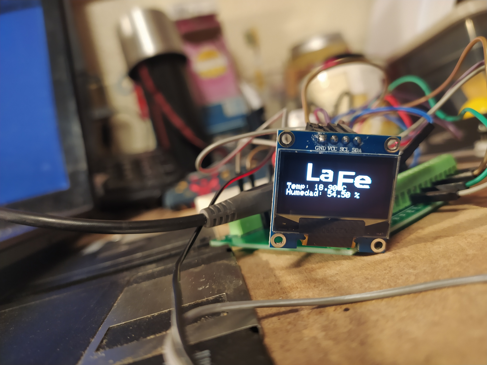
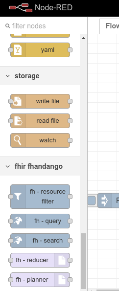
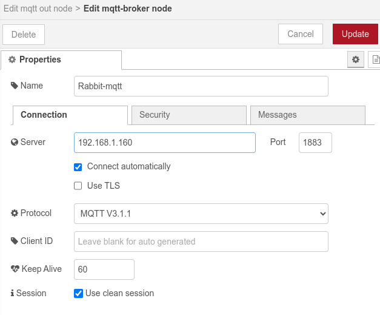
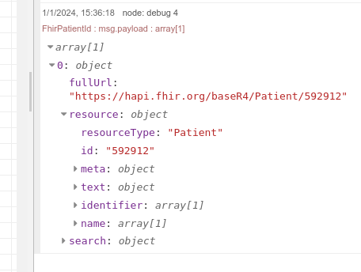

# FHIR Fhandango

## Resumen

Este es un proyecto de aprendizaje en el que se realizaron unas pruebas de concepto sobre FHIR en diversos entornos así como la integración del mismo con dispositivos inteligentes (IOT).

## Introducción

El proyecto busca abordar la creciente necesidad de una atención médica más integrada y reactiva, aprovechando el poder del Internet de las Cosas (IoT) y el estándar Fast Healthcare Interoperability Resources (FHIR). En el contexto actual, donde los datos médicos y la monitorización en tiempo real son fundamentales para la toma de decisiones clínicas, la falta de interoperabilidad entre dispositivos y sistemas de salud representa un desafío significativo. La motivación detrás de este proyecto es ahondar en algunas pruebas de concepto para dilucidar posibilidades de una solución que permita una comunicación fluida y segura entre dispositivos IoT y plataformas médicas que utilicen FHIR. 

Las preguntas que se buscan responder son: ¿Cómo podemos mejorar la integración y la comunicación de los datos médicos entre dispositivos y sistemas usando las tecnologías actuales? ¿Cómo podemos automatizar, monitorizar procesos en función de los datos obtenidos? ¿Qué protocolos son los más útiles a la hora de realizar dicha comunicación?

## Metodología

Para responder las preguntas principales del proyecto se utilizó un enfoque eminentemente práctico:

### **Diseño del Estudio**: 

El estudio se fundamenta en un experimento sencillo. Crear un prototipo rápido para comprobar la viabilidad de ciertos conceptos usando las tecnologías actuales. Las dificultades que surjan y los tiempos de desarrollo y la consecución de los objetivos se usarán para valorar posibles opciones y soluciones a futuro. Se usará un flujo de trabajo típico usando herramientas comunes y sustituibles realizando la abstracción de las mismas siendo cada componente sustituible por sus equivalentes de diversas compañías o desarrolladores. También se intentará hacer el estudio lo más reproducible posible, aportando el código fuente y la documentación necesaria para una experimentación en primera persona. De esta manera se podrán realizar posteriores revisiones e iteraciones del mismo. Se intentará también desacoplar los elementos del sistema a casos específicos del hospital y/o tecnologías usadas actualmente en el mismo, construyendo así un caso de uso lo más neutral posible para poder así, en caso de requerirlo, adaptar alguno de los mecanismos estudiados a cualquier necesidad que pueda surgir en el futuro y/o en diferentes ámbitos como por ejemplo el seguimiento doméstico.

### **Materiales y Herramientas**:

- Editor de texto: Sirve cualquiera pero para programar el Dispositivo IOT sólo sirven [VS Code](https://code.visualstudio.com/), [adruino](https://www.arduino.cc/en/software) y [Espressif ide](https://dl.espressif.com/dl/esp-idf/). 
- Motor de ejecución de código JavaScript: [Node JS](https://nodejs.org/en)
- Administrador de paquetes: [NPM](https://www.npmjs.com/)
- Servidor de pruebas abierto online, [HAPI](https://hapi.fhir.org/baseR4/) (https://hapi.fhir.org/baseR4/) 
- Herramienta de Flujo de trabajo: [Node-Red](https://nodered.org/)
- ESP32S (Node MCU 32S)
- Pantalla oled i2c 164x64
- Sensor de temperatura y humedad AM2302
- Placa de interconexiones para ESP32
- Botón reset reciclado de computador 
- Protoboard
- Cables

## **Construcción del Dispositivo IOT**:


La construcción del prototipo de IOT no fue difícil. Nos decantamos por el ESP32 como microcontrolador que es un producto de ESPRESSIF que está pre-certificado tanto para uso en la UE como para los EEUU. Es un producto que no sólo es barato porque ronda entre 2 y 6 euros (según el modelo) si no que también integra conexiones inalámbricas como son Wifi, BLE, ZigBEE y Thread. 

Para la construcción del prototipo se usó una placa de desarrollo rápido NODEMCU32S. Puedes encontrar todos los datos relacionados con los microcontroladores [ESP32](esp32_datasheet_en.pdf) y con la placa [NODEMCU32S](nodemcu-32s_product_specification.pdf) 

Está listo para usar en productos de producción en masa y actualmente lo están usando empresas como SONOFF, wemo belkin, SimplySafe, evapolar y Shelly entre otros para productos de domótica para el hogar. 

Al microcontrolador le añadimos una pantalla que funciona con i2c para visualizar los resultados, así como un sensor de temperatura y un botón para darle algo más de funcionalidad.




Todo esto se montó siguiendo el siguiente esquema electrónico.


## **Procedimientos**:

El proyecto intentó realizar una comunicación efectiva entre el servidor FHIR y el dispositivo IOT.

Para empezar tenemos 2 entes que tenemos que comunicar, un Servidor FHIR y un dispostivo IOT. 


**El primero**, realiza comunicaciones usando el protocolo de comunicación HTTP y sirve los datos en formato JSON, XML o Turtle.
**El segundo**, realiza comunicaciones usando protocolos diversos, estos se comunican usando diversas tecnologías como BLE, Wifi o Zigbee y usan protocolos como MQTT y HTTP entre otros.

Se pensó en varias formas de comunicar estos elementos, así que se estudiaron diversas opciones:

### Comunicación directa: Servidor-FHIR – Dispositivos IOT. 

Aunque perfectamente factible, y muy fácil de realizar, no es la más recomendada puesto que no posibilita la monitorización previa a inserción de datos en el servidor FHIR ni tampoco facilita la corrección de errores en caso de lecturas erróneas, múltiples lecturas del dispositivo IOT así como otras posibles excepciones y errores que se puedan producir. 


Además, este enfoque no permite integrar dispositivos que usen MQTT, BLE, THREAD o ZigBEE para la trasferencia de datos, dejando únicamente como posible integración los dispositivos que tengan una alta capacidad de cómputo y recursos energéticos como para usar Wifi y HTTP concretamente. 

### Comunicación con nodo intermedio: Servidor-FHIR – nodo intermedio – Dispositivos IOT

Una alternativa al anterior enfoque sería, una arquitectura un poco más compleja. Esta opción sería colocar un nodo intermedio entre ambos elementos.


Este enfoque es una mejora sustancial en el proceso, nos amplía el abanico, pero aún nos quedan aún cuestiones a responder. 
Es decir, al encontrarnos con gran variedad de dispositivos y/o protocolos, integrar los mismos dentro de un único nodo puede resultar complicado para una institución que no tenga grandes recursos, puesto que ello requeriría un amplio desarrollo además de un mantenimiento complejo y dificulta la escalabilidad. 
Plataformas de IOT como Azure, AWS, etc., facilitan este proceso, pero no todas las instituciones quieren o pueden poner los datos de los pacientes en manos de terceras entidades. 

Además hay que pensar en la eficiencia. 
Si resulta que el dispositivo que mide la temperatura está alojado en el mismo país, o incluso en la misma institución que lo gestiona, enviar datos a un tercer país, a miles de kms de distancia no es lo más recomendable en términos de eficiencia.

### Comunicación con múltiples nodos intermedios: Servidor-FHIR -nodos intermedios – Dispositivos IOT

Esta opción nos posibilita ir escalando en función de las necesidades y posibilidades de la institución sanitaria, así como reduce desarrollos que luego no se vayan a utilizar. 


Se reducen costos iniciales pero se aumenta enormemente la complejidad y administración de la información que proviene de dichos nodos, puesto que los datos pueden surgir de diversas fuentes así como de dispositivos que usen diferentes protocolos u otras variantes.

### Comunicación gestionada por administrador de flujo de datos: Servidor-FHIR- administrador – nodos intermedios – Dispositivos IOT

Aplicaciones como Node-Red o Airflow nos van a ayudar a solucionar parte de la problemática anterior.
Nos van a permitir homogeneizar los datos, monitorizar los mismos y a la vez ir escalando nuestro sistema poco a poco usando la variedad de nodos intermedios que necesitemos. 


A medida que se vayan introduciendo dispositivos con diferentes características dentro de nuestra institución sanitaria podemos ir ampliando el desarrollo y manejando el mantenimiento del mismo en función de las necesidades que vayan apareciendo. 
A la vez, estas aplicaciones nos permiten programar de manera más visual y  podemos desarrollar nodos nosotros mismos que permitan gestionar dispositivos IOT específicos y construir recursos FHIR a partir de otras formas de trasmisión de datos, que utilicemos dentro de nuestro sistema. Esto, lo realizamos gracias a que permiten ampliar sus funcionalidades ya sea con desarrollo de código y/o con plugins y otras fórmulas. 
Al ser estas unas herramientas que permiten una programación más visual y la posibilidad de extender funcionalidades mediante plugins o código personalizado, se reduce la complejidad del desarrollo y mantenimiento de la solución. Optar por una arquitectura con múltiples nodos intermedios y un administrador de flujo de datos como Node-Red o Airflow puede ofrece mayor flexibilidad y escalabilidad. 
Esto es particularmente valioso en entornos médicos donde los requisitos pueden cambiar rápidamente y la capacidad de adaptarse a nuevos dispositivos y protocolos es crucial.

### Desarrollo

Tras decidirnos por probar a montar algo sencillo siguiendo este último diseño,(servidorfhir-administrador-nodos-iot)  se comenzó con el desarrollo de bloques de node-red para la extracción y manejo de los datos del servidor FHIR.
Véase el código  del repositorio fhir-fhandango en pcsp-hulafe del portal web github. Se desarrollaron varios bloques de búsqueda, uno de filtrado de recursos FHIR así como bloques de aplanado y reducción de datos. 



Como se observa en la imagen a continuación, se enlazaron los nodos en un flujo de trabajo sencillo, que automatiza la obtención de los datos del servidor de pruebas HAPI con un identificador de paciente específico. 


Así, se obtienen todos los datos del paciente, se filtran por un determinado tipo de recurso FHIR y finalmente se envían usando el protocolo MQTT al dispotivo IOT.






Cada módulo se configuró y se colocaron bloques de debug para ver el flujo de los datos y cerciorarse que esos cambios se transmitían correctamente entre cada módulo. 


Cuando llegan los datos hasta el dispositivo IOT desarrollado, es este dispositivo el que realiza la medición de temperatura y tras pulsar un botón devuelve, los datos que recibió como mensaje MQTT además de las mediciones de temperatura y humedad.
Para la trasmisión vía mqtt se usaron dos temas, lafe/fhir2mqtt – para el envío de datos al dispositivo/s y lafe/mqtt2fhir para la acción contraria.
El dispositivo IOT se programó usando C++ y el editor de código VSCode con el plugin de Platformio. El código fuente se puede encontrar en el repositorio de pcsp-hulafe de github.

Se realizaron varias pruebas, se enviaron datos de manera sencilla con mqtt, e incluso se utilizó FHIR desde el mismo dispositivo IOT, enviando recursos similares al siguiente.

```json
{
  "resourceType": "Observation",
  "id": "iot-temperature-humidity-observation",
  "status": "final",
  "category": [
    {
      "coding": [
        {
          "system": "http://terminology.hl7.org/CodeSystem/observation-category",
          "code": "vital-signs",
          "display": "Vital Signs"
        }
      ]
    }
  ],
  "code": {
    "coding": [
      {
        "system": "http://loinc.org",
        "code": "LA6576-8",
        "display": "Ambient temperature and humidity"
      }
    ]
  },
  "subject": {
    "reference": "Patient/example"
  },
  "device": {
    "display": "IoT Temperature & Humidity Sensor"
  },
  "effectiveDateTime": "2023-09-15T10:30:00Z",
  "component": [
    {
      "code": {
        "coding": [
          {
            "system": "http://loinc.org",
            "code": "8310-5",
            "display": "Body temperature"
          }
        ]
      },
      "valueQuantity": {
        "value": 22.2,
        "unit": "degrees Celsius",
        "system": "http://unitsofmeasure.org",
        "code": "Cel"
      }
    },
    {
      "code": {
        "coding": [
          {
            "system": "http://loinc.org",
            "code": "Humidity",
            "display": "Ambient humidity"
          }
        ]
      },
      "valueQuantity": {
        "value": 60,
        "unit": "%",
        "system": "http://unitsofmeasure.org",
        "code": "%"
      }
    }
  ]
}
```

Finalmente, obtenemos las mediciones del dispositivo IOT a través de un broker MQTT configurad usando las herramientas básics que nos proporciona la aplicación Node-Red. 

Así podemos monitorizar los datos de manera sencilla y validar los mismos en caso de necesitarlo, todo esto antes de introducirlos en el registro correspondiente del servidor FHIR. Esto nos permite también automatizar acciones al vuelo, envío de mensajes, etc.,

## Conclusiones

Con las tecnologías que tenemos actualmente, no resulta muy complejo la integración FHIR-IOT. En este proceso de aprendizaje se observó también lo siguiente.
Por ejemplo, el uso de de nodos intermedios para asegurar la integridad de los datos, el uso de servicios que se encarguen de transformar dichos datos de la manera correcta y el uso de estándares como MQTT (con TLS) deben tenerse muy en cuenta en desarrollos para producción.


Lo sencillo que se puede volver el desarrollo de dispositivos médicos IOT para integrar de esta manera, ya que es la institución clínica la que obtiene los datos a través de sus propias herramientas y puede integrar esos datos para automatizaciones y/o almacenamiento de los mismos de múltiples maneras. 


La flexibilidad de FHIR, así como la facilidad de uso, nos permite integrar los datos incluso en los dispositivos IOT de baja potencia como los ESP32. Al estar basado en JSON, lo hace fácilmente integrable en los dispositivos IOT. Se puede incluso llegar a establecer especificaciones para la comunicación entre dispositivos que incluyan recursos como Device que incluyan timestamps y/o datos médicos relevantes dentro de un recurso Transaction.
 No obstante, hay que destacar la limitación de estos dispositivos, que al tener una memoria reducida y usar protocolos que usan una baja capacidad de transmisión de datos, no nos van a permitir enviar grandes documentos, pero esta es una conclusión obvia dado que nadie espera que un IOT de baja capacidad envíe los datos de una resonancia electromagnética, para ello ya existen protocolos como HTTP y/o FTP.


### Desarrollos futuros

Este repositorio son sólo unas pruebas de concepto, en un futuro se intentarán realizar más acciones como:

- Uso de múltiples clientes y pruebas de carga con mosquitto_pub/sub
- Monitorización avanzada de mqtt, posibles integraciones con grafana y otras aplicaciones BI.
- Desarrollo de una especificación más precisa para dispositivos IOT.
- Probar los sistemas de corrección de errores y la inserción de datos en el Servidor FHIR.
- Integración con plataformas domóticas del hogar como home assistant/casa.

Finally, we obtain the measurements from the IoT device through an MQTT broker configured using the basic tools provided by the Node-Red application.

This allows us to easily monitor the data and validate it if necessary, all before entering it into the corresponding registry of the FHIR server. This also allows us to automate actions on the fly, sending messages, etc.

## Conclusions

With the technologies we currently have, FHIR-IoT integration is not very complex. During this learning process, the following was also observed. For example, the use of intermediate nodes to ensure data integrity, the use of services that take care of transforming the data correctly, and the use of standards like MQTT (with TLS) should be taken into account in developments for production.

The development of IoT medical devices can become simple to integrate in this way, as it is the clinical institution that obtains the data through its own tools and can integrate those data for automation and/or storage in multiple ways.

The flexibility of FHIR, as well as its ease of use, allows us to integrate data even in low-power IoT devices like the ESP32. Being based on JSON, it is easily integrated into IoT devices. It is even possible to establish specifications for communication between devices that include resources like Device that include timestamps and/or relevant medical data within a Transaction resource. However, it is important to highlight the limitation of these devices, which, having limited memory and using protocols with a low data transmission capacity, will not allow us to send large documents, but this is an obvious conclusion since no one expects a low-capacity IoT device to send the data of an MRI, for which there are already protocols like HTTP and/or FTP.

### Future Developments

This repository is only a proof of concept, in the future more actions will be attempted such as:

- Use of multiple clients and load tests with mosquitto_pub/sub.
- Advanced monitoring of MQTT, possible integrations with Grafana and other BI applications.
- Development of a more precise specification for IoT devices.
- Testing error correction systems and data insertion in the FHIR Server.
- Integration with home automation platforms like Home Assistant/CASA.
