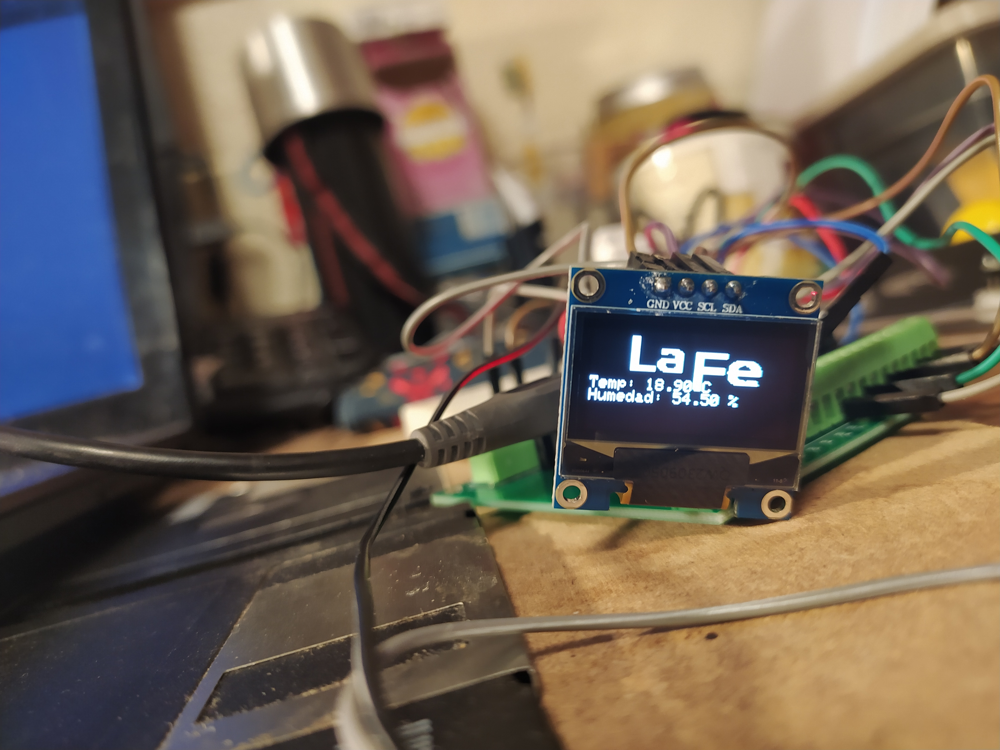
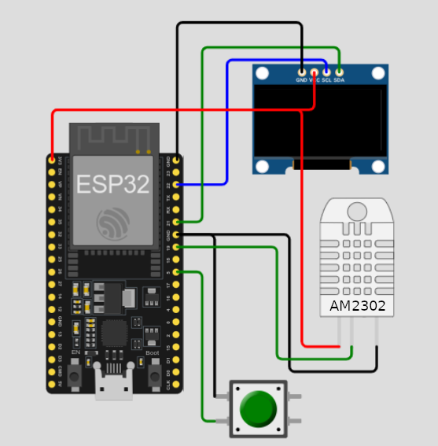
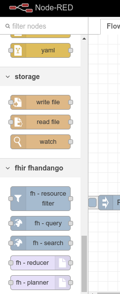
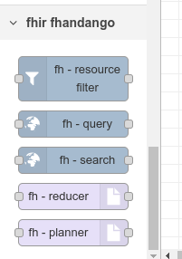
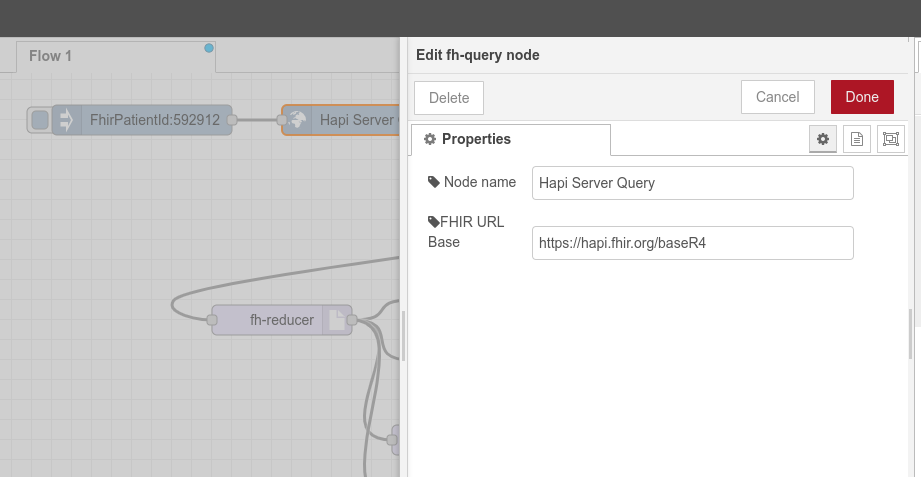
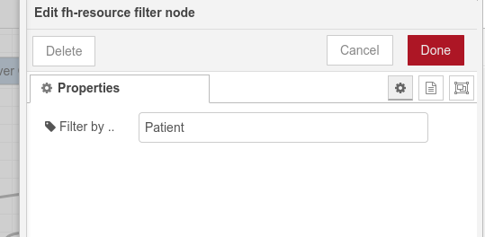
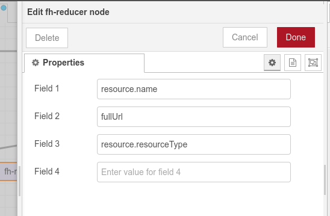
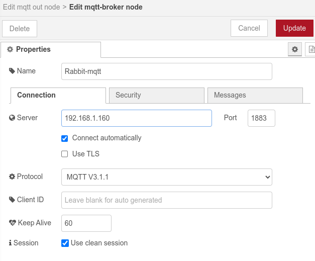
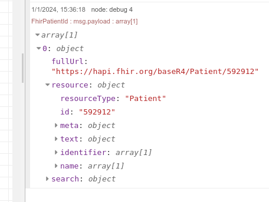

# FHIR Fhandango

### Disclaimer

Please note that this text has been automatically translated by a machine translation system and may contain inaccuracies or inconsistencies. While every effort has been made to ensure the quality of the translation, certain nuances and complexities might not be fully captured. In case of any doubt or for a more accurate understanding, please refer to the original version in Spanish. Your patience and understanding in this matter are greatly appreciated.

## Summary

This is a learning project in which proof of concept tests were carried out on FHIR in various environments as well as its integration with current and future smart devices (IoT).

## Introduction

The project seeks to address the growing need for more integrated and responsive medical care by leveraging the power of the Internet of Things (IoT) and the Fast Healthcare Interoperability Resources (FHIR) standard. In the current context, where medical data and real-time monitoring are fundamental to clinical decision-making, the lack of interoperability between devices and health systems represents a significant challenge. The motivation behind this project is to delve into some proof of concept tests to elucidate the possibilities of a solution that allows fluid and secure communication between IoT devices and medical platforms using FHIR.

The questions we seek to answer are: How can we improve the integration and communication of medical data between devices and systems using current technologies? How can we automate and monitor processes based on the data obtained? What protocols are most useful when communicating?

## Methodology

A decidedly practical approach was used to answer the main questions of the project:

### **Study Design**:

The study is based on a simple experiment. Create a quick prototype to test the viability of certain concepts using current technologies. The difficulties that arise and the development times and achievement of the objectives will be used to assess possible options and solutions for the future. A typical workflow will be used using common and substitutable tools by abstracting them, with each component being replaceable by equivalents from various companies or developers. An attempt will also be made to make the study as reproducible as possible, providing the source code and necessary documentation for first-hand experimentation. In this way, subsequent reviews and iterations of it can be carried out. An attempt will also be made to decouple the system elements from specific hospital cases and/or technologies currently used in it, thus building a case of use as neutral as possible so that, if required, some of the mechanisms studied can be adapted to any need that may arise in the future and/or in different areas such as domestic monitoring.

### **Materials and Tools**:

- Text editor: Any will serve, but for programming the IoT Device only [VS Code](https://code.visualstudio.com/), [Arduino](https://www.arduino.cc/en/software), and [Espressif IDE](https://dl.espressif.com/dl/esp-idf/) are useful.
- JavaScript code execution engine: [Node JS](https://nodejs.org/en)
- Package manager: [NPM](https://www.npmjs.com/)
- Open online test server, [HAPI](https://hapi.fhir.org/baseR4/) (https://hapi.fhir.org/baseR4/)
- Workflow tool: [Node-Red](https://nodered.org/)
- ESP32S (Node MCU 32S)
- OLED i2c 164x64 screen
- AM2302 temperature and humidity sensor
- Interconnection board for ESP32
- Computer recycled reset button
- Protoboard
- Cables

## **IoT Device Construction**:

Building the IoT prototype was not difficult. We opted for the ESP32 as a microcontroller which is a product of ESPRESSIF that is pre-certified for use in both the EU and the USA. It is a product that is not only cheap because it ranges between 2 and 6 euros (depending on the model) but also integrates wireless connections such as Wifi, BLE, ZigBEE, and Thread.

For the construction of the prototype, a NODEMCU32S rapid development board was used. You can find all the data related to the [ESP32](esp32_datasheet_en.pdf) microcontrollers and the [NODEMCU32S](nodemcu-32s_product_specification.pdf) board

It is ready to be used in mass production products and is currently being used by companies like SONOFF, wemo belkin, SimplySafe, evapolar, and Shelly among others for home automation products.

An i2c screen was added to the microcontroller to display the results, as well as a temperature sensor and a button for added functionality.

All this was mounted following the electronic scheme below.

## **Procedures**:

The project attempted to perform effective communication between the FHIR server and the IoT device.

To start we have 2 entities that we have to communicate, a FHIR Server and an IoT device.

**The first**, performs communications using the HTTP communication protocol and serves data in JSON, XML, or Turtle format.
**The second**, performs communications using various protocols, these communicate using various technologies such as BLE, Wifi, or Zigbee and use protocols such as MQTT and HTTP among others.

Several ways to communicate these elements were considered, so various options were studied:

### Direct Communication: FHIR Server – IoT Devices.

Although perfectly feasible, and very easy to carry out, it is not the most recommended as it does not allow monitoring prior to data insertion in the FHIR server nor does it facilitate the correction of errors in case of erroneous readings, multiple readings of the IoT device as well as other possible exceptions and errors that may occur.

Additionally, this approach does not allow the integration of devices that use MQTT, BLE, THREAD, or ZigBEE for data transfer, leaving only as possible integration devices that have a high computational capacity and energy resources to use Wifi and HTTP specifically.

### Communication with Intermediate Node: FHIR Server – Intermediate Node – IoT Devices

An alternative to the previous approach would be a slightly more complex architecture. This option would be to place an intermediate node between both elements.

This approach is a substantial improvement in the process, it broadens the spectrum, but we still have questions to answer.
That is, when faced with a wide variety of devices and/or protocols, integrating them within a single node can be complicated for an institution that does not have large resources, since this would require extensive development as well as complex maintenance and hinders scalability.
IoT platforms like Azure, AWS, etc., facilitate this process, but not all institutions want or can put patient data in the hands of third parties.

Moreover, efficiency must be considered.
If it turns out that the device measuring the temperature is housed in the same country, or even in the same institution that manages it, sending data to a third country, thousands of kilometers away is not the most advisable in terms of efficiency.

### Communication with Multiple Intermediate Nodes: FHIR Server -Intermediate Nodes – IoT Devices

This option allows us to scale according to the needs and possibilities of the health institution, as well as reduce developments that will not be used later.

Initial costs are reduced but the complexity and administration of the information coming from these nodes are greatly increased, since the data can arise from various sources as well as devices that use different protocols or other variants.

### Communication Managed by Data Flow Manager: FHIR Server- Manager – Intermediate Nodes – IoT Devices

Applications like Node-Red or Airflow are going to help us solve part of the previous problem.
They will allow us to homogenize the data, monitor it and at the same time scale our system little by little using the variety of intermediate nodes we need.

As devices with different characteristics are introduced within our health institution we can expand development and manage maintenance based on the needs that arise.
At the same time, these applications allow us to program in a more visual way and we can develop nodes ourselves that allow us to manage specific IoT devices and build FHIR resources from other forms of data transmission that we use within our system. This is done thanks to the fact that they allow their functionalities to be extended either with code development and/or with plugins and other formulas.
Being these tools that allow more visual programming and the possibility of extending functionalities through plugins or custom code, the complexity of development and maintenance of the solution is reduced. Opting for an architecture with multiple intermediate nodes and a data flow manager like Node-Red or Airflow can offer greater flexibility and scalability.
This is particularly valuable in medical environments where requirements can change rapidly and the ability to adapt to new devices and protocols is crucial.

### Development

After deciding to try to set up something simple following this last design (serverfhir-administrator-nodes-iot), we started with the development of node-red blocks for the extraction and handling of data from the FHIR server.
See the code for the fhir-fhandango repository at pcsp-hulafe on the github web portal. Several search blocks were developed, one for filtering FHIR resources as well as blocks for flattening and reducing data.

As shown in the image below, the nodes were linked in a simple workflow, which automates the obtaining of data from the HAPI test server with a specific patient identifier.

Thus, all the patient's data is obtained, filtered by a certain type of FHIR resource and finally sent using the MQTT protocol to the IoT device.

Each module was configured and debug blocks were placed to see the data flow and ensure that those changes were transmitted correctly between each module.

When the data reaches the developed IoT device, it is this device that performs the temperature measurement and after pressing a button returns, the data it received as an MQTT message in addition to the temperature and humidity measurements.
For transmission via mqtt, two topics were used, lafe/fhir2mqtt – for sending data to the device/s and lafe/mqtt2fhir for the opposite action.
The IoT device was programmed using C++ and the VSCode code editor with the Platformio plugin. The source code can be found in the pcsp-hulafe repository on github.

Several tests were carried out, data was sent in a simple way with mqtt, and FHIR was even used from the same IoT device, sending resources similar to the following.

